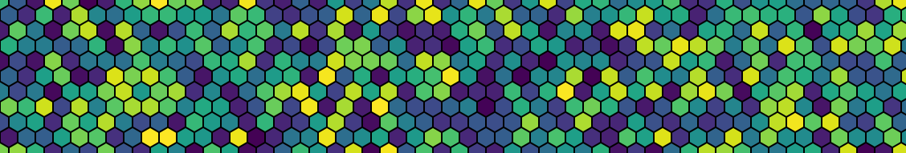

## About Me

Hi, I'm James Hoctor. I am a Machine Learning Engineer and Data Scientist with experience in natural language processing, computer vision, regression, time series classification, model explanability, and interpretable models.
*I’m on the job market, so check out my [resume](https://drive.google.com/file/d/1dtkw-Jbo9DwJQrXAMmUa1jVqRovOlD3d/view?usp=share_link) and Selected Repos (below) if you’re hiring.*

<!-- old versions of this bullet point
- 🔭 I’m currently working on personal projects relating to large language models and fault-tolerant neural networks
- 🔭 I’m currently working on projects in topic modeling, sentiment analysis, and document classification
-->
- 🌐 [My website](https://james.hoctor.xyz/)
- 🌐 [My old website](https://jehoctor.github.io/), which is still a good way to explore my presence online 
- ⚡ Fun fact: My GitHub bio contains code written in [Brainfuck](https://en.wikipedia.org/wiki/Brainfuck). You can run it with an interpreter such as [beef](https://github.com/andreabolognani/beef?tab=readme-ov-file).
- 📫 How to reach me: send a connection request to [my account on LinkedIn](https://www.linkedin.com/in/james-hoctor/). Mention "GitHub profile" in the message so that I'm sure to see it.

<!--
Other bullets I could add one day:

- 🔭 I’m currently working on ...
- 🌱 I’m currently learning ...
- 👯 I’m looking to collaborate on ...
- 🤔 I’m looking for help with ...
- 💬 Ask me about ...
- 📫 How to reach me: ...
- ⚡ Fun fact: ...
-->

## Selected Repos

- [My blog automation](https://github.com/JEHoctor/james.hoctor.xyz). I'm planning to write about how I automate my blog soon. The automation code is already published here.
- [Advent of Code 2020 solutions in Python](https://github.com/alinajadebarnett/AoC2020), a project with [Alina Jade Barnett](https://github.com/alinajadebarnett). We list our completion time for each problem in the readme. I never expected that we would be ranked 80th on the global leaderboard for one problem!
- [Banner image generator in Python](https://github.com/JEHoctor/LinkedIn-Cover-Image). This is what I used to make the banner for this readme, my banner on LinkedIn, my banner on Thingiverse, etc. Now with Gaussian process noise!
- [My isosurface-based vase generator](https://github.com/JEHoctor/isosurface-vase), a Python-and-VTK-powered 3D art project
- [adventure-llm](https://github.com/JEHoctor/adventure-llm), playing a classic text adventure with a large language model API
- [spelling-bee-cheat](https://github.com/JEHoctor/spelling-bee-cheat), a NYT Spelling Bee cheating tool, that was intended to use tf-idf and logistic regression, though never finished...
<!-- old list entries
- [Advent of Code 2017 solutions in Rust](https://github.com/JEHoctor/AoC2017), a current solo project
-->
